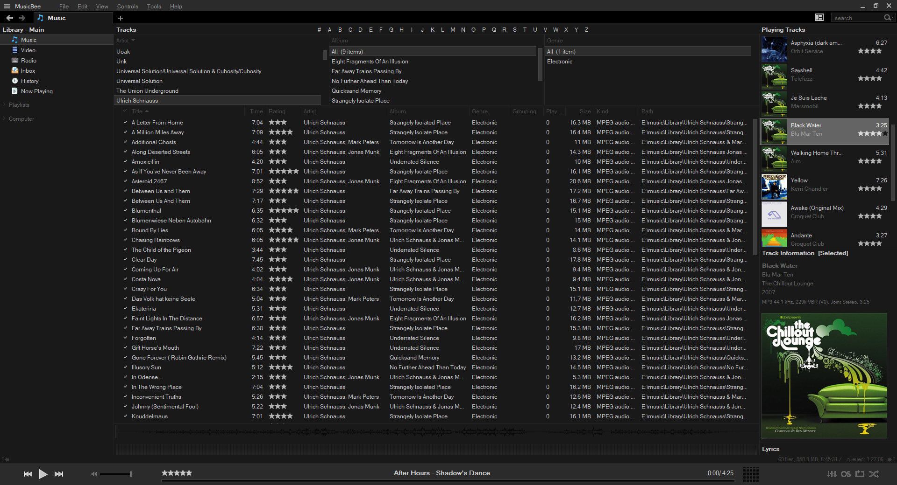

# musicbee-panel-layout
 My MusicBee panel layout as shown in my MusicBee video series.

# Installation
1. In MusicBee, go to View -> Import/Export -> Import Panel Arrangement
2. Select panel file.

# Suggested Skins
* MusicBee3
* MidnightMETRO (Under Dark skins)